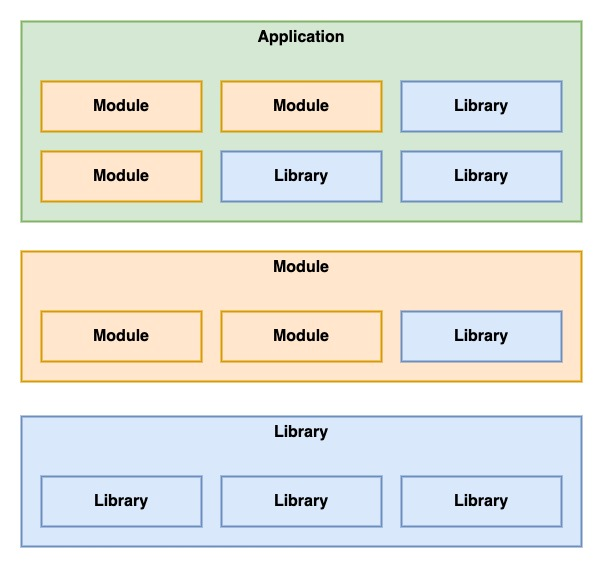

# monorepo-setup
a guide to setup a monorepository

For the full setup from scratch description please see here [Setup](./doc/SETUP.md)

## getting started

```
git clone https://github.com/atothek1/monorepo-setup.git
cd monorepo-setup
npx lerna bootstrap
```
## structure

Below is a highlevel folder structure. The monorepo distinguish between 3 types of packages, apps, libs and mods.

### apps
An application(app) package is a standalone full application which can be deployed and served.
An application can use/integrate modules and libraries, and of course its application specific code.
An application can NOT integrate other application, it can only link to them.

Examples:
* blog
* shop
* backoffice

### libs
A library(lib) package is a scoped set of functionality. 
A library can use other libraries but it can NOT use modules or applications.

Examples:
* utils
* components
* services
* etc.

### mods
A module(mod) package provides a clear scoped set of functionality that is close to an application.
It contains all logic to provide a sealed set of features, including services, components, pages, etc.
It provides an interface how to integrate it into an application or a module.
It is NOT standalone and can NOT be deployed and served as an application. 
A module can use/integrate libraries and other modules, but it can NOT integrate applications.

Examples:
* auth
* registration
* shopping-cart
* post
* etc.

### Diagram


### Highlevel folder structure
```
root
  |-- build/
  |-- config/
  |-- doc/
  |-- packages/
    |-- apps/
      |-- my-application/
        |-- config/
        |-- res/
        |-- src/
    |-- libs/
      |-- my-library/
        |-- config/
        |-- res/
        |-- src/
    |-- mods/
      |-- my-module/
        |-- config/
        |-- res/
        |-- src/
```

## lerna commands

### run scripts in all packages
```shell script
lerna run build
lerna run build --stream
```
also see [here](https://github.com/lerna/lerna/tree/main/commands/run)

### bootstrap
```shell script
lerna bootstrap
```
also see [here](https://github.com/lerna/lerna/tree/main/commands/bootstrap)

### create a new package
```
lerna create @mono/example-app --dependencies core-js react react-dom react-router react-router-dom formik yup
```

### add a package to an existing package
only single packages can be added at a time.
```
lerna add --dev --scope=@mono/example-app @types/react
```
also see [here](https://github.com/lerna/lerna/tree/main/commands/add)

## docker commands

### docker build image

```
docker build -t app-test .
```

### docker run a container and remove after exit
```
docker run --name test-app --rm -p 8080:80 app-test
```

## list all docker container
```
docker ps -a
```

## list all docker images
```
docker images
```
## remove a docker container
```
docker rm [ID or name]
```

## remove a docker image
```
docker rmi [ID or name]
```

Notes:

storybook setup for component libraries
complete flow of creating and integrating a package
codeowners
